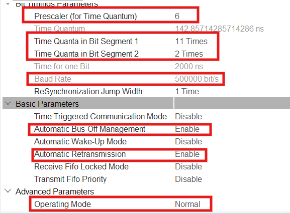
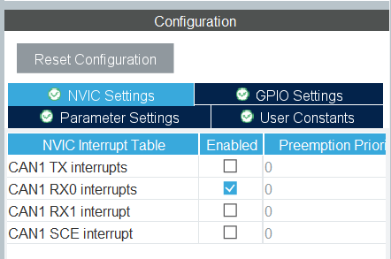
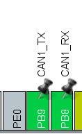

# STM32 <--> Raspberry Pi 4B CAN Bidirectional Communication #

이 프로젝트는 STM32F4(Nucleo-F429ZI) MCU와 Raspberry PI 4B(APU)간의 CAN BUS 양뱡향 통신을 구현한 예제

- MCU : STM32(HAL CAN Driver 기반)
- APU : Raspberry PI 4B(Linux SocketCAN 기반)
- 통신 방식 : Standard CAN(11-bit ID)
- 전송 데이터 : 문자열 기반 테스트 message

---

## 프로젝트 목록 ##
1. MCU(Telechips_CAN_Bidirectional_STM32)
2. APU(Telechips_CAN_Bidirectional_RPI4)
 

## 하드웨어 구성 ##

|항목|설명|
| ------ | --- |
|Target Board | NUCLEO-F429ZI|
|CAN Transceiver | mcp2551 / TJA1050|
|CAN Controller | MCP2515|
|APU | RPI4B |

---

## CAN ID 정의 ##
|Dir|CAN ID|
| ------ | --- |
| APU -> MCU | 0x123|
| MCU -> APU | 0x456|


---

# STM32 Firmware CAN 환경 설정 #

## 1. CAN 설정 ##


- Mode : Normal
- Bitrate : 500kbps
- Basic Parameters
    - Automatic Bus-Off Management Enable
    - Automatic Retransmission Enable


- RX FIFO0 Interrupt Enable


- PB8(CAN1_TX), PB9(CAN1_RX) set


---
# Raspberry Pi 4B SocketCAN 환경 설정 #

## 1. 필수 패키치 설치하기 ##
``` bash
sudo apt update
sudo apt install -y can-utils net-tools build-essential
```

설치 확인해보기:
```bash
candump --help
cansend --help
```
---
## 2. CAN Kernel Module Load ##
```bash
sudo modprobe can
sudo modprobe can_raw
sudo modprobe can_dev
sudo modprobe mcp251x
```

설치 확인:
```bash
lsmod | grep can
```

---
## 3. SPI 인터페이스 활성화 ##

```bash
sudo raspi-config
```

```text
Interface Options -> SPI -> Enable
```

재부팅하기: 
```bash
sudo reboot
```
---
## 4. MCP2515 Device Tree Overlay Settings ##

```bash
sudo nano /boot/firmware/config.txt
```
config.txt 파일에 다음과 같은 내용 추가:

```text
dtparam=spi=on
dtoverlay=mcp2515-can0,oscillator=8000000,interrupt=25,spimaxfrequency=2000000
```

|항목|의미|
| ------ | --- |
| oscillator | MCP2515 크리스탈 주파수|
|interrupt| INT 핀(GPIO)|
|spimaxfrequency| SPI 클럭 |

재부팅하기:
```bash
sudo reboot
```
---
## 5. CAN Interface Check ##

```bash
ip link show
```

정상으로 설치가 되었다면? :
```text
can0: <NOARP,ECHO>
```

---

## 6. CAN Bitrate 설정 및 활성화 ##

```bash
sudo ip link set can0 down
sudo ip link set can0 type can bitrate 500000 restart-ms 100
sudo ip link set can0 up
```

활성화 되었는지 확인:
```bash
ip -details link show can0
```


## 7. CAN-Tools로 CAN 통신 Test ##
 SocketCAN C코드로 실행 전에 반드시 수행 할 것!!

 ### 수신 테스트 ###

 ```bash
 candump can0
 ```

 ### 송신 테스트 ###
  ```bash
 cansend 123#48656C6C6F
 ```

출력 예시:
```bash
can0  123   [5]  48 65 6C 6C 6F
```
 --> "Hello"로 메시지 출력됨

## 8. Raspberry PI SocketCAN C 코드 실행 ##

### 컴파일 수행 ###
```bash
gcc -o TRX TRX.c
```

### 실행하기 ###
```bash
sudo ./TRX
```
### 실행 결과(with STM32 UART) ###


- COM8 : STM32 Uart
- COM12 : RPI4B SocketCAN 

